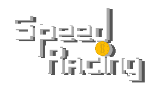

  

A real-time local multiplayer racing game built with sockets and threading. Play solo or with up to **5 people** on the same Wi-Fi network.

Written in **Python** using the **Arcade library v2.6.17**.

## Features:
1. Customizable Keybinds
2. Other Player location prediction
3. Robust server
4. Multiple Cars
5. Multiple Maps
6. Drifting
7. Speed Boosts
8. Slow Spots
9. Powerups
10. Coins
11. SFX
    

### Demo here:

### Download on itch.io:
https://ldpgames.itch.io/racing-game

